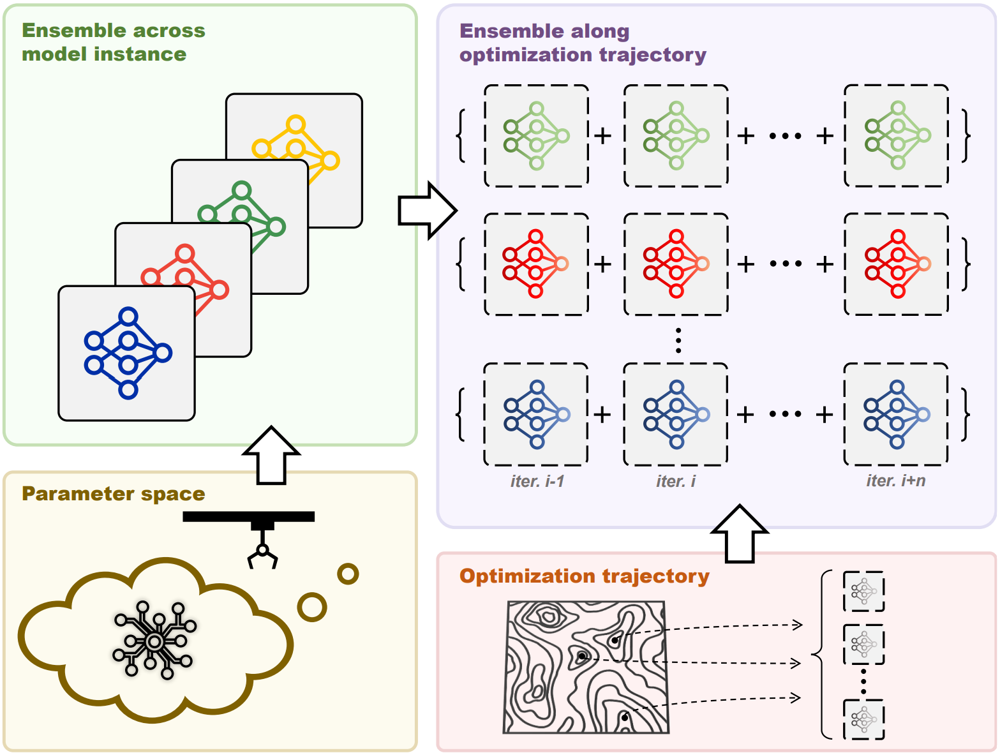

This is the official implementation of the paper "[Robust Stochastic Neural Ensemble Learning with Noisy Labels for Thoracic Disease Classification](https://ieeexplore.ieee.org/document/10413624)".

<div align="center">
  
</div>


## Citation
If this code is helpful for your study, please cite:
```
@ARTICLE{10413624,
  author={Wang, Hongyu and He, Jiang and Cui, Hengfei and Yuan, Bo and Xia, Yong},
  journal={IEEE Transactions on Medical Imaging}, 
  title={Robust Stochastic Neural Ensemble Learning with Noisy Labels for Thoracic Disease Classification}, 
  year={2024},
  volume={},
  number={},
  pages={1-1},
  keywords={Noise measurement;Biomedical imaging;Training;X-ray imaging;Optimization;Stochastic processes;Ensemble learning;Thoracic diseases;image classification;deep learning;label noise;chest X-ray},
  doi={10.1109/TMI.2024.3357986}}

```